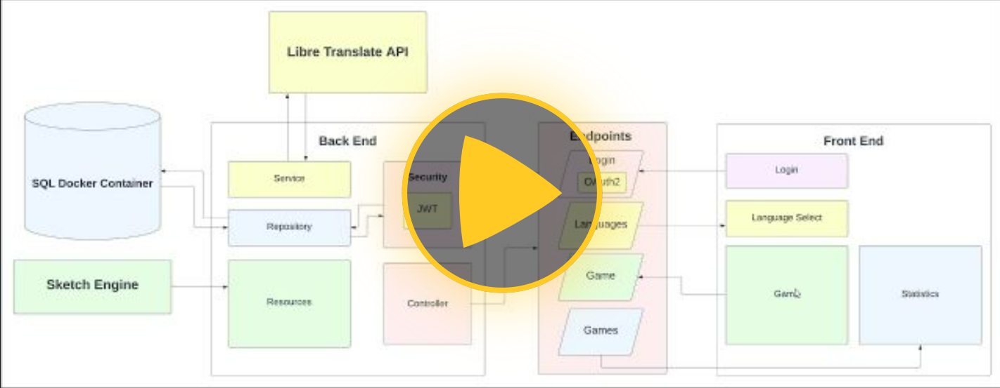
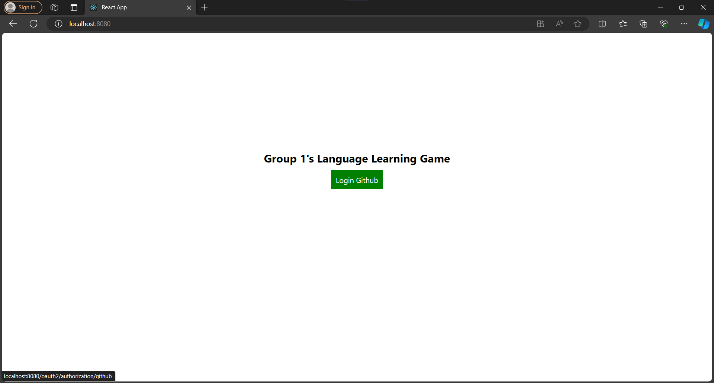

<a name="readme-top"></a>


<!-- PROJECT SHIELDS -->
<!--
*** I'm using markdown "reference style" links for readability.
*** Reference links are enclosed in brackets [ ] instead of parentheses ( ).
*** See the bottom of this document for the declaration of the reference variables
*** for contributors-url, forks-url, etc. This is an optional, concise syntax you may use.
*** https://www.markdownguide.org/basic-syntax/#reference-style-links
-->


<!-- PROJECT LOGO -->
<br />
<div align="center">

  <h3 align="center">Language Practice game</h3>

  <p align="center">
    Made for CSU33012 Software Engineering
    <br />
    <a href="https://media.heanet.ie/page/76efd0fbe4d146269e1370a384c0e62e">View Demo</a> 
    ·
    <a href="https://gitlab.scss.tcd.ie/elsherbr/practice-languages-api/-/issues">Report Bug</a>
    ·
    <a href="https://gitlab.scss.tcd.ie/elsherbr/practice-languages-api/-/issues">Request Feature</a>
  </p>
</div>


<!-- TABLE OF CONTENTS -->
<details>
  <summary>Table of Contents</summary>
  <ol>
    <li>
      <a href="#about-the-project">About The Project</a>
      <ul>
        <li><a href="#built-with">Built With</a></li>
      </ul>
      <ul>
        <li><a href="#features">Features</a></li>
      </ul>
    </li>
    <li>
      <ul>
        <li><a href="#requirements">Requirements</a></li>
        <li><a href="#installation">Installation</a></li>
      </ul>
    </li>
    <li><a href="#diary">Diary</a></li>
    <li><a href="#contributing">Contributing</a></li>
  </ol>
</details>


<!-- ABOUT THE PROJECT -->
## About The Project

[](https://media.heanet.ie/page/76efd0fbe4d146269e1370a384c0e62e)

### Both backend and frontend (2 videos) are covered within 1 video

[Language Practice game](https://practice-languages.fly.dev)

There are many great README templates available on GitHub; however, I didn't find one that really suited my needs so I created this enhanced one. I want to create a README template so amazing that it'll be the last one you ever need -- I think this is it.

Here's why:
* Your time should be focused on creating something amazing. A project that solves a problem and helps others
* You shouldn't be doing the same tasks over and over like creating a README from scratch
* You should implement DRY principles to the rest of your life :smile:

Of course, no one template will serve all projects since your needs may be different. So I'll be adding more in the near future. You may also suggest changes by forking this repo and creating a pull request or opening an issue. Thanks to all the people have contributed to expanding this template!

<p align="right">(<a href="#readme-top">back to top</a>)</p>


### Built With

This section should list any major frameworks/libraries used to bootstrap your project. Leave any add-ons/plugins for the acknowledgements section. Here are a few examples.

* Spring Boot
* [![React][React.js]][React-url]
* Spring Security
* Maven
* MySQL
<p align="right">(<a href="#readme-top">back to top</a>)</p>


## Features

- CRUD
- Login
- Authentication
- Responsive


## Requirements

For building and running the application you need:

- [JDK 17.0](https://www.oracle.com/java/technologies/javase/jdk17-archive-downloads.html)
- [Maven 4](https://maven.apache.org)

## Installation

```
$ git clone https://gitlab.scss.tcd.ie/elsherbr/practice-languages-api.git

$ cd practice-languages-api

```

Then create a database with name MYSQL69 in your mysql. Can be done manually through workbench etc.

However our choice is through Docker

```
$ docker run --name sweng-languagegame-db -p 3306:3306 -e MYSQL_DATABASE=MYSQL69 -e MYSQL_ROOT_PASSWORD=securepassword -d mysql

```

If database is having trouble connecting open the file "src/main/java/resources/application.properties" and make sure the data is 
properly set according to the database.

When database is properly configured run maven to build the project, and package it into one application.

```
$ mvn clean install
```


Now, we're ready to start the application. Make sure you quit any running servers, and run the jar file

```
$ java -jar target/languagegame-0.0.1-SNAPSHOT.jar


  .   ____          _            __ _ _
 /\\ / ___'_ __ _ _(_)_ __  __ _ \ \ \ \
( ( )\___ | '_ | '_| | '_ \/ _` | \ \ \ \
 \\/  ___)| |_)| | | | | || (_| |  ) ) ) )
  '  |____| .__|_| |_|_| |_\__, | / / / /
 =========|_|==============|___/=/_/_/_/
 :: Spring Boot ::        (v2.0.1.RELEASE)

2023-04-11 11:53:44.983  INFO 93434 --- [           main] n.k.s.LanguagePractice                   : Starting LanguagePractice v0.0.1-SNAPSHOT on oven.local with PID 93434 (/Users/oven/git/practice-languages-api/target/languagegame-0.0.1-SNAPSHOT.jar started by oven in /Users/oven/git/practice-languages-api)
2023-04-11 11:53:44.986  INFO 93434 --- [           main] n.k.s.LanguagePractice                   : No active profile set, falling back to default profiles: default
2023-04-11 11:53:45.045  INFO 93434 --- [           main] ConfigServletWebServerApplicationContext : Refreshing org.springframework.boot.web.servlet.context.AnnotationConfigServletWebServerApplicationContext@5af3afd9: startup date [Wed Apr 11 11:53:45 CEST 2023]; root of context hierarchy
2023-04-11 11:53:46.180  INFO 93434 --- [           main] o.s.b.w.embedded.tomcat.TomcatWebServer  : Tomcat initialized with port(s): 8080 (http)
2023-04-11 11:53:46.221  INFO 93434 --- [           main] o.apache.catalina.core.StandardService   : Starting service [Tomcat]
2023-04-11 11:53:46.222  INFO 93434 --- [           main] org.apache.catalina.core.StandardEngine  : Starting Servlet Engine: Apache Tomcat/8.5.29
[...]
2023-04-11 11:53:47.039  INFO 93434 --- [           main] o.s.b.w.embedded.tomcat.TomcatWebServer  : Tomcat started on port(s): 8080 (http) with context path ''
[...]
```


Open your web browser, and navigate to http://localhost:8080. You should now see the following:



<p align="right">(<a href="#readme-top">back to top</a>)</p>


<!-- Diary -->
## Diary

- Week 1 entry design decisions:
* We met up as a group for the first time and tried brainstorming for ideas. We were able to come up with a good few choices but not any definitive easy choices,
hence we went for the democratic option of everyone voting via ranking the choices in the order of their favourites.

* We eventually chose our current idea yet then found out it would be hard to decide on how to get input from user since like if we were to have a language translate to some other language, meanings may be lost in translation. On top of that, how would we change the language of the entire program, to instruct a person of a different native language on
how to choose language options ?

- Week 2 entry design decisions:
* Although our members had some experience with Spring Boot, almost noone had experience with React.js, and we found it difficult to pass components, design a single page application and efficiently make use of useState.
  
* We found out that utilising the translation API, the speed of certain languages (with things such as translating, fetching etc.) were faster than others for reasons unknown to our implementation. 
  
- Week 3 entry design decisions:
* Some of the word pairs returned from the our language translation API, Libre Language API, would return word pairs where multiple translations of the same word to English existed.  This made handling word pairs in the Game non trivial, and brought up much meaningful discussion regarding the implementation of the game.
  
* When we met with the topic of Authenticating, we wanted all types of authentication to be done the same way. This meaning that a normal Account register and login would be done via entering Account details, then as an Authentication token,  a Json Web Token (JWT) is returned. However when implementing further types of Authentication such as Open Authorisation 2 (OAuth2) via platforms like Google, and Github, they would authenticate and return different tokens, such as Custom Authentication tokens, or JSESSIONID's. This led to the difficult task of taking in these different types of Authentication tokens and "transforming" it into our stylised JWT's.

- Week 4 entry design decisions:
* We have run into the problem of our group lacking manpower towards the end of the project, with less and less being accomplished, while there was still plenty of work to do. This was due to a multitude of Assignments slowly encroaching upon us with deadlines back to back. This led to the team of effective working members on either the frontend and backend team to fall to an average of 1 - 2 members.
  
* The backend team has run into a massive conundrum with features being unable to properly display their potential due to Cross-Origin Resource Sharing (CORS) issues. this led to sleepless nights of little productivity, with a fix being merely a couple lines of code. However at least it has been resolved
  UPDATE: The deadline is nigh, and the horrors of CORS has returned. Unfortunately we have left our [WebPage](https://practice-languages.fly.dev) of a single CORS issue, however it is a fatal one blocking our single POST request used for displaying user statistics.


<!-- Contributed -->
## Contributing

Ramy El-Sherbiny - elsherbr@tcd.ie

Daniel Padmore  - padmored@tcd.ie

Daniel Farushev - farushed@tcd.ie

Eliel Oshiokameh - oshiokae@tcd.ie

Nandini Gupta - nagupta@tcd.ie

Project Link: [https://gitlab.scss.tcd.ie/elsherbr/practice-languages-api](https://gitlab.scss.tcd.ie/elsherbr/practice-languages-api)

<p align="right">(<a href="#readme-top">back to top</a>)</p>


[React-url]: https://reactjs.org/
[React.js]: https://img.shields.io/badge/React-20232A?style=for-the-badge&logo=react&logoColor=61DAFB
